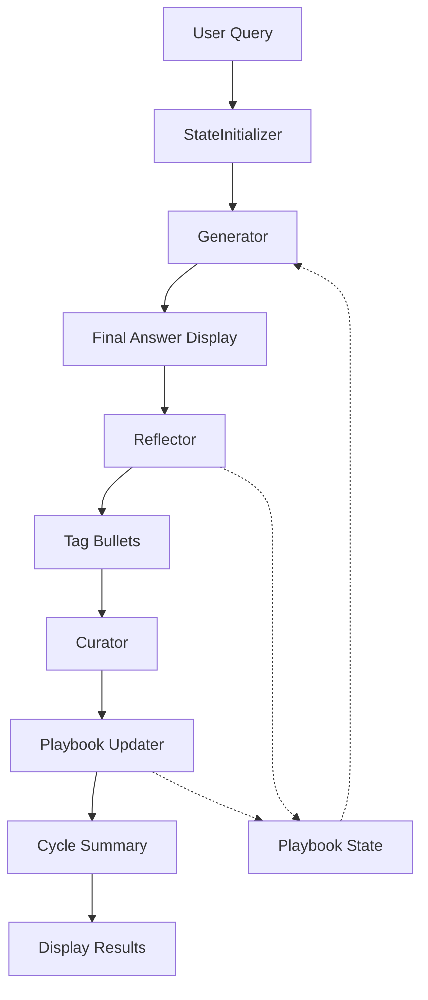

# ACE-ADK (Agentic Context Engineering – Agent Development Kit)

A self-improving AI agent system that learns through iterative cycles of generation, reflection, and curation. Built with Google ADK and Gemini 2.5 Flash, ACE-ADK maintains a dynamic knowledge playbook that evolves with each interaction.

[](https://www.python.org/downloads/)
[](https://github.com/google/adk)
[](LICENSE)

## Overview

ACE-ADK implements an "Agentic Context Engineering" approach where agents continuously improve their performance by:
- **Learning from mistakes**: Identifying what works and what doesn't
- **Building knowledge**: Maintaining a structured playbook of proven strategies
- **Adapting responses**: Applying learned insights to future queries
- **Self-reflection**: Analyzing output quality and updating strategies

## Key Features

- **Self-Improving Agent System**: Learns and evolves with each interaction
- **Dynamic Knowledge Playbook**: Automatically builds and maintains strategy repository
- **Transparent Reasoning**: Shows step-by-step thought process with bullet references
- **Quality Tracking**: Tags strategies as helpful, harmful, or neutral
- **Error Handling**: Robust validation and graceful failure recovery
- **Modern UI**: Clean, professional web interface with real-time updates
- **Prominent Answer Display**: Clear formatting of final answers and cycle summaries

## Quick Start

### Prerequisites

- Python 3.11 or higher
- Google API Key (for Gemini models)
- pip or uv package manager

### Installation

1. **Clone the repository**
```bash
git clone https://github.com/jahidulzaid/agentic-context-engineering.git
cd agentic-context-engineering
```

2. **Install dependencies**

Using pip:
```bash
pip install google-adk fastapi uvicorn
```

Using uv:
```bash
uv sync
```

3. **Configure environment**
```bash
cp .env.example .env
# Edit .env and add your GOOGLE_API_KEY
```

4. **Run the application**
```bash
python main.py
```

5. **Access the interface**
- Web Interface: http://localhost:8080
- API Documentation: http://localhost:8080/docs
- Interactive API: http://localhost:8080/redoc

## Architecture

### Agent Workflow

```
StateInitializer → Generator → FinalAnswerDisplay → Reflector → Curator → CycleSummary
```

### Core Components

#### 1. **Generator Agent**
- Generates answers using the current playbook
- Shows step-by-step reasoning
- References specific playbook strategies
- Displays final answer prominently

#### 2. **Reflector Agent**
- Analyzes generator output quality
- Identifies errors and patterns
- Tags playbook bullets as helpful/harmful/neutral
- Provides key insights for improvement

#### 3. **Curator Agent**
- Updates the playbook based on reflections
- Adds new strategies
- Modifies existing bullets
- Removes outdated information
- Limited to 3 operations per cycle for stability

#### 4. **Cycle Summary**
- Displays complete cycle statistics
- Shows playbook evolution metrics
- Provides answer recap
- Tracks tag distributions

### Data Flow



## Project Structure

```
agentic-context-engineering/
├── main.py                          # Application entry point
├── config.py                        # Configuration settings
├── pyproject.toml                   # Dependencies
├── .env.example                     # Environment template
├── agents/
│   └── ace_agent/
│       ├── __init__.py
│       ├── agent.py                 # Main agent orchestration
│       ├── schemas/
│       │   ├── __init__.py
│       │   ├── playbook.py          # Playbook data structures
│       │   └── delta.py             # Change operation schemas
│       └── sub_agents/
│           ├── __init__.py
│           ├── generator.py         # Answer generation
│           ├── reflector.py         # Quality analysis
│           └── curator.py           # Playbook updates
└── docs/
    ├── UI_IMPROVEMENTS.md
    └── FINAL_ANSWER_FEATURE.md
```

## Configuration

### Environment Variables (`.env`)

```env
# Required: Google AI API Key
GOOGLE_API_KEY=your-google-api-key-here

# Optional: Vertex AI Configuration
GOOGLE_GENAI_USE_VERTEXAI=False
GOOGLE_CLOUD_PROJECT=your-project-id
GOOGLE_CLOUD_REGION=us-central1
```

### Application Settings (`config.py`)

```python
class Config(BaseModel):
    # Model configuration
    generator_model: str = "gemini-2.5-flash"
    reflector_model: str = "gemini-2.5-flash"
    curator_model: str = "gemini-2.5-flash"
    
    # Server configuration
    server_host: str = "0.0.0.0"
    server_port: int = 8080
```

## Usage Examples

### Basic Interaction

1. Open http://localhost:8080
2. Enter your question in the chat interface
3. Watch the agent process through all stages
4. See the final answer displayed prominently
5. Review the cycle summary for insights

### Example Query Flow

**User:** "What is 2 + 2?"

**Generator Output:**
```
╔══════════════════════════════════════════════════════════════╗
║                      FINAL ANSWER                            ║
╚══════════════════════════════════════════════════════════════╝

2 + 2 equals 4.

━━━━━━━━━━━━━━━━━━━━━━━━━━━━━━━━━━━━━━━━━━━━━━━━━━━━━━━━━━━━━━
Reasoning Steps: 2
Playbook Bullets Used: 0
```

**Cycle Summary:**
```
╔══════════════════════════════════════════════════════════════╗
║                  ACE CYCLE COMPLETE                          ║
╚══════════════════════════════════════════════════════════════╝

PLAYBOOK STATUS
Sections: 1
Total Bullets: 2
Helpful Tags: 1
Harmful Tags: 0
Neutral Tags: 1
```

## Data Models

### Playbook Structure

```python
class Bullet:
    id: str                  # Unique identifier
    section: str             # Category/section
    content: str             # Strategy description
    helpful: int             # Helpful tag count
    harmful: int             # Harmful tag count
    neutral: int             # Neutral tag count
    created_at: str          # ISO timestamp
    updated_at: str          # ISO timestamp

class Playbook:
    bullets: Dict[str, Bullet]
    sections: Dict[str, List[str]]
    next_id: int
```

### Delta Operations

```python
class DeltaOperation:
    type: Literal["ADD", "UPDATE", "REMOVE"]
    section: str
    content: Optional[str]
    bullet_id: Optional[str]

class DeltaBatch:
    reasoning: str
    operations: List[DeltaOperation]  # Max 3 per cycle
```

## Advanced Features

### Output Limiting
- Generator: Limited reasoning depth for efficiency
- Curator: Max 3 operations per cycle to prevent overflow
- Prompts: Strict character limits (80-100 chars) for stability

### Error Handling
- Graceful JSON parsing failures
- Malformed curator output recovery
- Operation count enforcement
- Clear error messages to users

### Playbook Management
- Automatic ID generation
- Section organization
- Tag statistics tracking
- Serialization/deserialization
- Prompt-ready formatting

## Troubleshooting

### Common Issues

**1. Import Errors**
```bash
pip install --upgrade google-adk fastapi uvicorn
```

**2. API Key Issues**
- Verify `.env` file exists
- Check `GOOGLE_API_KEY` is set correctly
- Ensure no extra quotes or spaces

**3. Port Already in Use**
```bash
# Change port in config.py
server_port: int = 8081
```

**4. JSON Validation Errors**
- These are handled gracefully
- Check logs for LLM output issues
- May need to adjust prompt limits

## Development

### Running in Development Mode

```bash
# Enable hot reload
uvicorn main:app --reload --port 8080
```

### Running Tests

```bash
pytest tests/
```

### Code Style

```bash
ruff check .
ruff format .
```

## Performance Optimization

- **Token Limits**: Strict output controls prevent runaway generation
- **Caching**: Playbook state persists across sessions
- **Batching**: Operations grouped for efficiency
- **Model Selection**: Uses efficient Gemini 2.5 Flash by default

## Roadmap

- [ ] Persistent playbook storage (JSON/SQLite)
- [ ] Multi-user session support
- [ ] Playbook versioning and rollback
- [ ] Advanced analytics dashboard
- [ ] Custom model provider support
- [ ] Evaluation metrics tracking
- [ ] Export/import playbook functionality

## Contributing

Contributions are welcome! Please:

1. Fork the repository
2. Create a feature branch (`git checkout -b feature/amazing-feature`)
3. Commit your changes (`git commit -m 'Add amazing feature'`)
4. Push to the branch (`git push origin feature/amazing-feature`)
5. Open a Pull Request

## License

This project is licensed under the MIT License - see the [LICENSE](LICENSE) file for details.

## Acknowledgments

- Built with [Google ADK](https://github.com/google/adk)
- Powered by Gemini 2.5 Flash
- Inspired by Agentic Context Engineering research

## Support

- **Issues**: [GitHub Issues](https://github.com/AIAnytime/agentic-context-engineering/issues)
- **Discussions**: [GitHub Discussions](https://github.com/AIAnytime/agentic-context-engineering/discussions)
- **Documentation**: See `docs/` folder for detailed guides

---

**[JahidulZaid](https://github.com/JahidulZaid)**